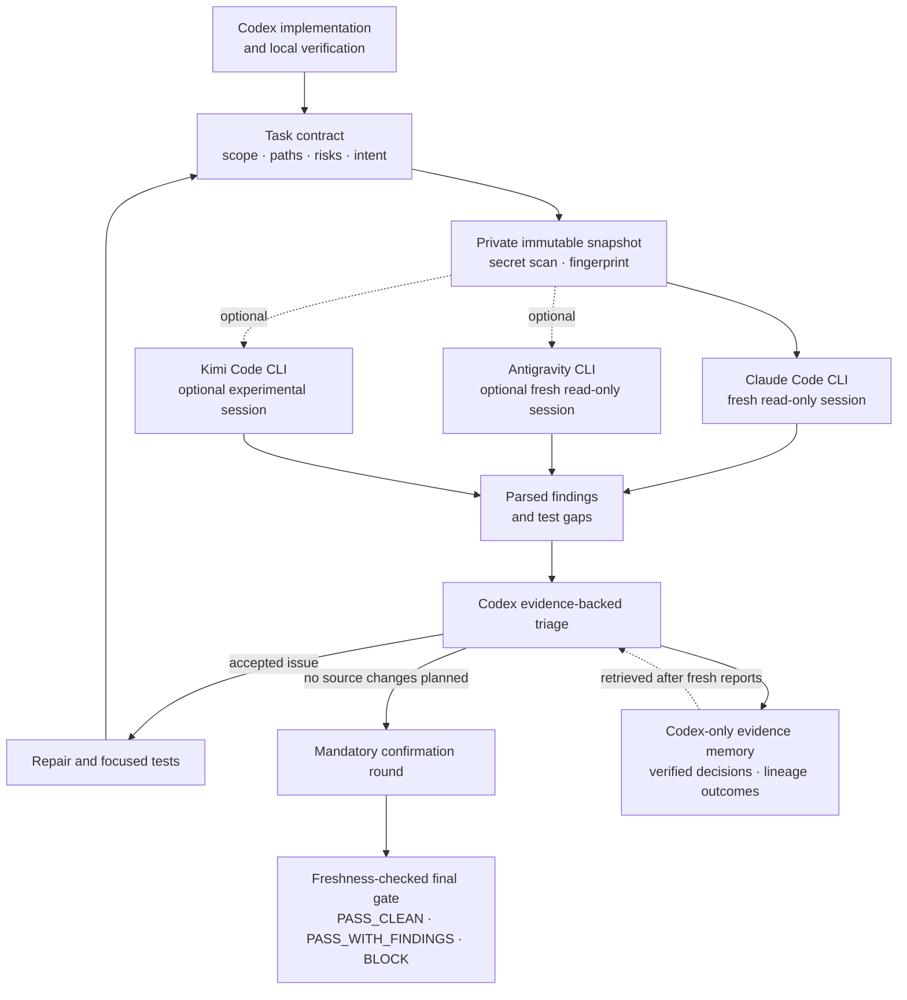

# Codex Multi-Model Review

[](https://github.com/shoti/codex-multi-model-review/actions/workflows/ci.yml)
[](https://www.python.org/)
[](LICENSE)

Auditable, bounded multi-model code reviews for Codex.

Codex remains the implementer and final verifier. External coding CLIs inspect
an immutable repository snapshot in fresh, read-only sessions. Their findings
become evidence-backed decisions, not automatic edits, and the final gate
becomes invalid when the reviewed source changes.

Claude Code is enabled by default. Antigravity and Kimi Code are optional and
disabled until explicitly enabled.

> This is an independent community project. It is not affiliated with or
> endorsed by OpenAI, Anthropic, Google, Moonshot AI, or their affiliates.

## Why

Asking several models to “review this diff” does not create a reliable gate by
itself. Reports can inspect moving code, repeat already-rejected findings,
silently miss part of the task, consume unbounded credits, or become stale
after the next edit.

Codex Multi-Model Review turns that conversation into a durable workflow:

- each reviewer starts fresh and does not see another reviewer's findings;
- reviewers inspect the same private, immutable repository snapshot;
- Codex verifies every finding against repository evidence;
- repair rounds are bounded and followed by mandatory confirmation;
- scope, paths, risks, profile, and task intent stay pinned across rounds;
- provider failures, usage, decisions, and test gaps are persisted;
- reviewers disclose incomplete coverage and unreviewed changed paths in a
  structured contract that cannot disappear into free-form notes;
- Claude output is schema-constrained and partial provider failures are resumable;
- cumulative Claude spend is capped across the whole successor lineage, not only per call;
- a private rebuildable evidence index helps Codex compare prior verified outcomes
  after fresh reviewers finish, without biasing reviewer prompts;
- a final PASS is valid only while its source fingerprint remains fresh.



## Requirements

- macOS or Linux. Native Windows is not currently supported.
- Python 3.12 or newer.
- Git.
- A current Codex CLI with `codex plugin` support.
- At least one installed and authenticated reviewer CLI.

The runner has no third-party Python dependencies.

| Reviewer | Default | Executable | Notes |
|---|---:|---|---|
| Claude Code | Enabled | `claude` | `sonnet`, medium effort, and a $1.25 maximum per review by default |
| Antigravity | Disabled | `agy` | Requires authenticated model access and the bundled hard read-only agent |
| Kimi Code | Disabled | `kimi` | Experimental adapter; validates that the configured model alias is available |

Provider CLIs are separate products with their own installation,
authentication, terms, data handling, quotas, and billing.

## Installation

Add this GitHub repository as a Codex marketplace, then install the plugin:

```bash
codex plugin marketplace add shoti/codex-multi-model-review --ref main
codex plugin add multi-model-review@codex-multi-model-review
```

Start a new Codex thread after installation so its skill and slash command are
loaded.

To update later:

```bash
codex plugin marketplace upgrade codex-multi-model-review
codex plugin add multi-model-review@codex-multi-model-review
```

For local development:

```bash
git clone git@github.com:shoti/codex-multi-model-review.git
cd codex-multi-model-review
codex plugin marketplace add "$PWD"
codex plugin add multi-model-review@codex-multi-model-review
```

The repository-root marketplace layout is exercised locally before release.
See the official [Codex plugin packaging
guide](https://developers.openai.com/plugins/build/plugins) for marketplace
concepts and alternative layouts.

## Quick start

In a new Codex thread:

> Use $multi-model-review to review my uncommitted changes. Limit the task to
> `src/feature` and `tests/feature`, use the security profile, and keep optional
> reviewers disabled.

Or invoke the bundled command:

```text
/multi-model-review:multi-review uncommitted without-antigravity without-kimi
```

Codex will create the workflow, run the repair and triage loop, perform the
mandatory confirmation, and return a freshness-checked final gate.

Run static diagnostics before the first provider review:

```bash
python3 <plugin-root>/skills/multi-model-review/scripts/mm_review.py doctor
```

`mm-review` is an optional local PATH shortcut. The bundled Python command
always works.

## Workflow

The normal Codex-driven flow is:

1. Finish the implementation and focused local checks.
2. Start one workflow for the user task with a deliberate review mode and an
   explicit cumulative budget when the default `$5.00` cap is not appropriate.
3. Run a repair review against explicit scope, paths, risks, and intent.
4. Verify and disposition every finding and test gap.
5. Fix accepted items and rerun focused tests.
6. Repeat only when necessary, within the selected repair-round limit.
7. Run one mandatory confirmation with no further source changes planned,
   reusing the pinned repair contract.
8. Finalize and verify the freshness-checked repository gate, then finalize the
   workflow so its state becomes explicitly `completed`.
9. If authorized later, attest the unchanged reviewed snapshot to its commit.

If the confirmation reviewer reports incomplete coverage, finalization stops.
Run another independent review or inspect every disclosed path and limitation,
then pass concrete `--coverage-verification` evidence. The final artifact keeps
both the provider's limitation and Codex's compensation visible.

Review mode is pinned with the workflow:

| Mode | Use for | Repair policy |
|---|---|---|
| `fast` | Small, localized, low-risk changes | One low-effort repair, then medium-effort confirmation |
| `balanced` | Ordinary features and bug fixes; the default | Up to two medium-effort repairs, then confirmation |
| `deep` | Auth, money, trading, data writes, migrations, email, security, or broad cross-component changes | Up to three medium-effort repairs, then confirmation |

Every mode retains the immutable snapshot, full triage, mandatory independent
confirmation, freshness verification, and commit attestation controls. Use
`deep` whenever a risk label applies; speed should come from avoiding redundant
rounds, not weakening a high-impact review.

If one provider fails after another provider has produced a valid report, the
run is preserved as `partial`. Resume that exact immutable snapshot instead of
paying the successful provider again. If the task contract must change after a
confirmation, explicitly supersede the closed workflow so the lineage remains
auditable. The original budget and all prior spend follow that lineage; a
successor is not a fresh credit allowance.

Secret and symlink checks that stop before any provider invocation are reported
as `preflight_blocked`, separately from failed reviews and provider failures.
Exact secret approvals remain one-shot and fingerprint-bound.
When attaching an existing successor with `workflow supersede --by`, its budget
must exactly match the current lineage cap; mismatched workflows are rejected.

Before starting, `mm-review recommend` can conservatively suggest `fast`,
`balanced`, or `deep` from the actual changed paths and explicit risks. The
recommendation is advisory and any selected risk keeps the result at `deep`.
`mm-review budget-estimate` separately compares the current patch with local
provider history and reports a non-binding p90-based budget recommendation.
It reports cost-bearing samples separately from all comparable attempts, so
failures without usage data still count toward exhaustion evidence. It never
changes effort, budgets, providers, or workflow policy automatically.

Resume history is append-only: earlier attempt metadata and provider artifacts
remain available, and every reported attempt cost counts toward the workflow
cap. Claude budget exhaustion requires an explicit one-resume effort or budget
override instead of silently repeating the same capped attempt.

Resume holds a run-specific lock for the complete transaction. Overlapping
attempts against one artifact serialize; after the first succeeds, the next
observes that the run is already complete instead of sharing its snapshot or
overwriting its evidence.

For the complete operational contract, see
[SKILL.md](skills/multi-model-review/SKILL.md).

### Scopes

| Scope | Meaning |
|---|---|
| `--uncommitted` | Staged, unstaged, and untracked changes |
| `--base <branch>` | Feature branch relative to a base, plus working-tree changes |
| `--commit <sha>` | One checked-out commit |

`--path` limits the changed paths, patch, fingerprint, and task contract. For
review context, the immutable snapshot still contains the entire tracked Git
tree at the selected revision. Read [Privacy and data handling](#privacy-and-data-handling)
before reviewing a sensitive repository.

The runner prints and records changed paths excluded by `--path`. Inspect that
local notice: keep unrelated dirty files excluded, but include every changed
dependency required by the reviewed behavior.

For a path-filtered `--commit` review, working-tree changes outside those paths
do not block the immutable commit snapshot. Changes inside the reviewed paths
still fail closed so task-scoped work cannot be omitted accidentally.

### Risk labels and profiles

Risk labels are repeatable:

`auth`, `backfill`, `db-write`, `email-send`, `email-deliverability`,
`external-api`, `migration`, `security`, and `trading`.

Profiles are:

`normal`, `security`, `data-change`, `external-api`, `trading`, and
`email-deliverability`.

These are generic review presets. They do not indicate that this repository
contains applications or data in those domains.

## Advanced manual example

Codex normally operates these commands through the skill. For debugging or
automation, the runner can be driven directly:

```bash
RUNNER="<plugin-root>/skills/multi-model-review/scripts/mm_review.py"

python3 "$RUNNER" doctor
python3 "$RUNNER" workflow start \
  --name "harden session validation" \
  --max-budget-usd 5

python3 "$RUNNER" run \
  --repo /path/to/repository \
  --uncommitted \
  --workflow-id <workflow-id> \
  --phase repair \
  --path src/session \
  --path tests/session \
  --risk auth \
  --risk security \
  --review-profile security \
  --task "Reject expired sessions without changing valid-session behavior"
```

The run output identifies its artifact directory. Record each disposition:

```bash
python3 "$RUNNER" decide \
  --run <run-directory> \
  --finding claude-001 \
  --decision rejected \
  --evidence "The reported path is unreachable after validation." \
  --verification "Focused session test passes."
```

If the run is partial, retry only its failed reviewers without changing the
source:

```bash
python3 "$RUNNER" resume --run <partial-run-directory>
```

If Claude reached its per-review cap, choose an explicit retry policy while
keeping the source unchanged:

```bash
python3 "$RUNNER" resume --run <partial-run-directory> \
  --claude-max-budget-usd 2 --claude-effort medium
```

When repair triage is complete, load the pinned contract for confirmation, then:

```bash
python3 "$RUNNER" run --repo /path/to/repository \
  --uncommitted --workflow-id <workflow-id> \
  --phase confirmation --reuse-contract

python3 "$RUNNER" finalize \
  --run <confirmation-run-directory> \
  --codex-review "Final diff review found no remaining defect." \
  --verification "Focused tests: passed"

python3 "$RUNNER" verify --run <confirmation-run-directory>
python3 "$RUNNER" workflow finalize <workflow-id>
```

The explicit scope selector may be omitted. When present, it must resolve to
the pinned scope; paths, risks, profile, and task cannot be re-specified.

### Supplemental rechecks

When a finalized snapshot is still fresh and the user asks one additional
question, avoid paying for another repair-plus-confirmation pair:

```bash
python3 "$RUNNER" run \
  --supplemental-of <finalized-run-directory> \
  --task "Check this unchanged snapshot for the focused concern"
python3 "$RUNNER" finalize \
  --run <supplemental-run-directory> \
  --codex-review "Focused recheck result"
python3 "$RUNNER" verify --run <supplemental-run-directory>
```

This performs exactly one fresh review and writes `supplemental.json` with an
explicitly non-authoritative status. It never replaces the parent `final.json`.
Every supplemental sibling shares the parent's task-lineage cap and active
reservations, so repeated rechecks cannot create new budget allowances.
If it identifies a real issue requiring source changes, create a normal linked
successor and run the full repair/confirmation workflow.

### Token-efficient inspection

Provider-reported token counters are aggregated by provider, model, review
mode, and phase; local artifact sizes are aggregated by mode and phase. The
runner does not estimate missing provider usage or confuse bytes with tokens:

```bash
python3 "$RUNNER" analytics --since-days 30 --format compact
python3 "$RUNNER" workflow status <workflow-id> --format compact
python3 "$RUNNER" workflow audit --stale-days 7 --format compact
python3 "$RUNNER" budget-estimate --uncommitted --review-mode balanced
```

Complete JSON remains the default for scripts and auditing. Compact output is
opt-in, points back to full artifacts/evidence, and automatically falls back to
JSON if it would emit more UTF-8 bytes.
Analytics keeps explicit adaptive-mode lineages separate from modes inferred
for legacy workflows, reports unclassified legacy run records, and exposes
cost/duration/patch distributions. `workflow audit` is read-only: it identifies
pending triage, unclosed run finals, failures, and stale incomplete work without
rewriting or deleting evidence.

### Evidence memory

The authoritative record remains the private JSON artifacts. A derived local
SQLite index makes their triaged evidence searchable by repository, finding
kind, title, path, evidence, action, verification, lineage, and decision:

```bash
python3 "$RUNNER" memory rebuild
python3 "$RUNNER" memory status
python3 "$RUNNER" memory search "duration threshold alert" --format compact
python3 "$RUNNER" memory compact
```

Memory retrieval happens only after independent reports return and is never
included in external reviewer prompts. The index is rebuildable and introduces
no third-party dependency or network call. `compact` affects only the derived
index; authoritative artifacts remain append-only and are never deleted
automatically.
When a triage item has `memory_matches`, Codex may add
`--memory-assessment useful|irrelevant|mixed` to `decide`, or the equivalent
`memory_assessment` field to `decide-batch`. Analytics reports candidate and
assessment counts separately from exact repeated-title matches, providing
evidence for future retrieval tuning without influencing reviewers.

## Command reference

| Command | Purpose |
|---|---|
| `status` | Show reviewer configuration and readiness |
| `doctor [--live]` | Check packaging, permissions, CLI contracts, and optional live access |
| `enable` / `disable [--lock]` | Persist reviewer availability; a lock also rejects one-run overrides |
| `set-model` | Set a reviewer model |
| `set-effort` | Set Claude reasoning effort |
| `set-budget` | Set Claude's per-review USD cap |
| `set-workflow-budget` | Set the default cumulative Claude USD cap for new workflows |
| `workflow start/status/audit/supersede/finalize` | Manage adaptive review mode and task lineage; audit is read-only and status/audit support compact output |
| `scan` | Issue a one-shot fingerprint-bound approval after inspecting secret findings |
| `run` | Execute a repair, confirmation, or exact-content supplemental round |
| `resume` | Retry only failed reviewers from an unchanged partial run |
| `decide` / `decide-batch` | Persist evidence-backed triage and optional memory-candidate assessments |
| `finalize` | Produce a final gate, requiring Codex evidence for incomplete confirmation coverage |
| `verify` | Confirm that the gate still matches current source |
| `attest-commit` | Bind unchanged reviewed content or a clean reviewed `--base` branch to the checked-out commit |
| `recover` | Mark an orphaned run failed after its process exits |
| `analytics` | Summarize explicit versus inferred mode cohorts, workflow outcomes, tokens, artifact bytes, memory telemetry, failures, spend, and closure |
| `recommend` | Suggest a conservative review mode from current paths and explicit risks |
| `budget-estimate` | Report an advisory historical Claude budget estimate for the current scope without changing policy |
| `memory status/rebuild/search/compact` | Maintain and query ranked Codex-only verified evidence; search supports opt-in compact output |

Use `python3 .../mm_review.py <command> --help` for all flags.

## Trust model

| Control | What it provides | Boundary |
|---|---|---|
| Immutable snapshot | Reviewers do not inspect a changing checkout | The tracked repository tree is passed to every enabled provider CLI |
| Read-only sessions | Reviewers receive read/search-only tool policies | Provider and CLI implementations remain external dependencies |
| Independent prompts | Reviewers do not receive one another's findings | All reviewers receive the same task contract and source |
| Secret screening | Blocks likely credentials, sensitive paths, external symlinks, and common secret patterns | It scans changed material heuristically, not every unchanged tracked file |
| Evidence-backed triage | Codex records why every item was accepted, fixed, rejected, deferred, or uncertain | Model agreement is not evidence |
| Evidence memory | Codex can retrieve similar prior decisions after fresh reports finish | Historical evidence is never passed to reviewers and the JSON artifacts remain authoritative |
| Freshness checks | Scoped source changes invalidate the final gate | A finalized confirmation is intentionally closed |
| Approval boundary | Review results never authorize external actions | The user retains authority over commits, merges, deployments, migrations, and production changes |

External symlinks always fail closed and cannot be waived. The broad sensitive
path override should be used only after deliberately reviewing the entire
snapshot.

When a changed line matches a secret rule but is intentionally safe test data,
run `scan --approve-findings` against the exact scope and paths first. The
resulting token is one-shot and bound to the repository, task paths, findings,
and source fingerprint. It cannot approve later edits, a broader review, a
sensitive path, or an external symlink.

## Privacy and data handling

The runner does not add a separate telemetry service, but enabled provider CLIs
may transmit reviewed source to their providers under those providers' terms
and account settings. Review only code you are authorized to share with every
enabled provider.

The snapshot contains the entire tracked Git tree at the reviewed revision,
plus the task-scoped working-tree overlay. Path filters do not make unchanged
tracked files private. Secret screening checks the patch and changed paths; an
existing secret in an unchanged tracked file can still enter the snapshot.
Inspect sensitive repositories before starting an external review.

Persistent local state is stored under:

- `~/.codex/review-runs/`;
- `~/.codex/review-runs/sensitive-scans/` for one-shot scan approvals;
- `~/.codex/review-runs/evidence-memory.sqlite3` for rebuildable Codex-only
  evidence search;
- `~/.config/multi-model-review/config.json`;
- `~/.config/multi-model-review/provider-health.json`.

Artifacts can contain patches, repository paths and origin, task prompts,
reviewer responses, raw provider output, usage metadata, and triage evidence.
They are created with private permissions on supported systems, but must not be
committed, uploaded, or attached to public issues.

Provider executables are resolved from `PATH`. Install trusted CLIs from their
official distribution channels and verify which executable your shell selects.

The built-in secret scan is defense in depth. It is not a substitute for a
repository secret scanner or deliberate source review.

## Cost controls

Claude is enabled by default with a `$1.25` maximum per review invocation and a
`$5.00` cumulative maximum per task lineage. Successor workflows inherit all
ancestor spend. Before every call, the runner reduces
the next Claude cap to the smaller of the per-review limit and the lineage's
remaining budget. Each run atomically reserves its maximum while locking the
lineage workflow documents, so concurrent repositories cannot reserve the same dollars. It fails
closed when less than `$0.05` remains. Most workflows should converge well
before the limit.

Every resume attempt is retained and charged to that cumulative calculation;
a failed paid attempt cannot be hidden by a later successful retry. Use
`--claude-effort` and `--claude-max-budget-usd` on `run` or `resume` for
one-attempt tuning. The `set-effort` and `set-budget` commands change persistent
defaults.

After budget exhaustion, lowering effort counts as a meaningful retry only if
the per-review budget is not also reduced. This avoids paying for a predictably
weaker retry that is even more likely to exhaust its cap.

The reservation is released after provider results and reported usage are
persisted. If the runner process is forcibly killed, its reservation remains
conservatively unavailable rather than silently permitting overspend; inspect
and recover the interrupted run before deciding whether to supersede the
lineage with a new explicit budget.

`doctor --live` performs provider calls and gives its Claude probe a `$0.10`
cap. Plain `status` and `doctor` do not probe disabled providers. Antigravity
and Kimi usage is governed by their accounts; the runner does not enforce an
equivalent USD cap for them.

Provider-reported cost and usage are recorded when available. A configured cap
is a safety limit, not a prediction of the final bill.

## Troubleshooting

- **Cache/source mismatch:** update the marketplace, reinstall the plugin, and
  start a new thread.
- **Provider CLI missing:** install the provider's official CLI and authenticate
  it, then rerun `doctor`.
- **Antigravity agent missing or changed:** run
  `mm-review install-antigravity-agent`.
- **Quota cooldown:** wait for the reported reset or disable that provider.
- **Interrupted run:** after confirming its process exited, use
  `mm-review recover --run <run-directory>`.
- **Partial run:** keep the source unchanged and use
  `mm-review resume --run <run-directory>`; only failed reviewers run again.
- **Claude budget exhausted:** resume only with an explicit
  `--claude-max-budget-usd` and/or lower `--claude-effort`; the cumulative
  workflow cap still applies.
- **Stale final gate or changed confirmation contract:** use
  `mm-review workflow supersede <workflow-id> --reason "<why>"`, then review
  under the reported successor workflow.
- **Review contract drift:** use `--reuse-contract` for confirmation. Explicitly
  supersede only when scope, paths, risks, profile, or task truly changed.
- **Sensitive material blocked:** remove it from scope, or run
  `mm-review scan ... --approve-findings` and pass the returned token to the
  exact review after inspecting every redacted finding. External symlinks and
  sensitive paths cannot be approved this way.
- **Kimi model unavailable:** choose an alias reported by
  `kimi provider list --json`, or leave Kimi disabled.
- **Malformed provider output:** inspect the redacted error artifact, update the
  provider CLI if needed, and rerun a fresh review.
- **`mm-review` is not on PATH:** invoke the bundled Python script directly.
- **Updated plugin is not visible:** start a new Codex thread after reinstall.

## Limitations

- External reviewers can miss defects or report false positives.
- This workflow is not a formal proof or a replacement for tests, security
  assessment, or human approval.
- Provider CLI flags and output formats can change; `doctor` fails closed when
  required contracts are unavailable.
- Windows is not supported natively because the runner uses POSIX file locks,
  permissions, signals, and process groups.
- Source is sent to every enabled reviewer provider.
- Kimi support relies on an experimental CLI and may change.
- A later scoped edit requires a new workflow after confirmation.
- Commits, pushes, merges, deployments, migrations, backfills, messages, and
  live transactions remain outside the plugin's authority.

## Contributing and security

See [CONTRIBUTING.md](CONTRIBUTING.md) for the dependency-free development
workflow and [SECURITY.md](SECURITY.md) for private vulnerability reporting.

## License

Released under the [MIT License](LICENSE).
